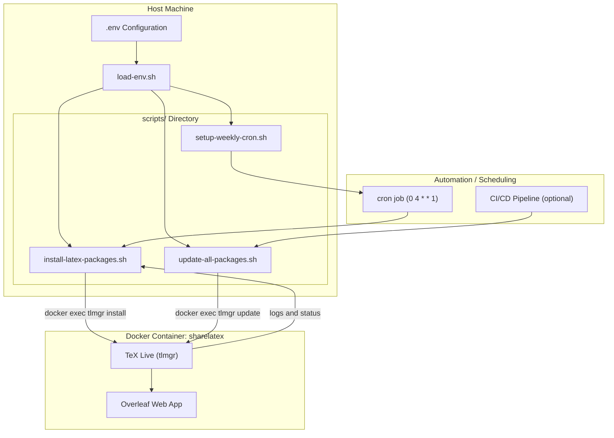
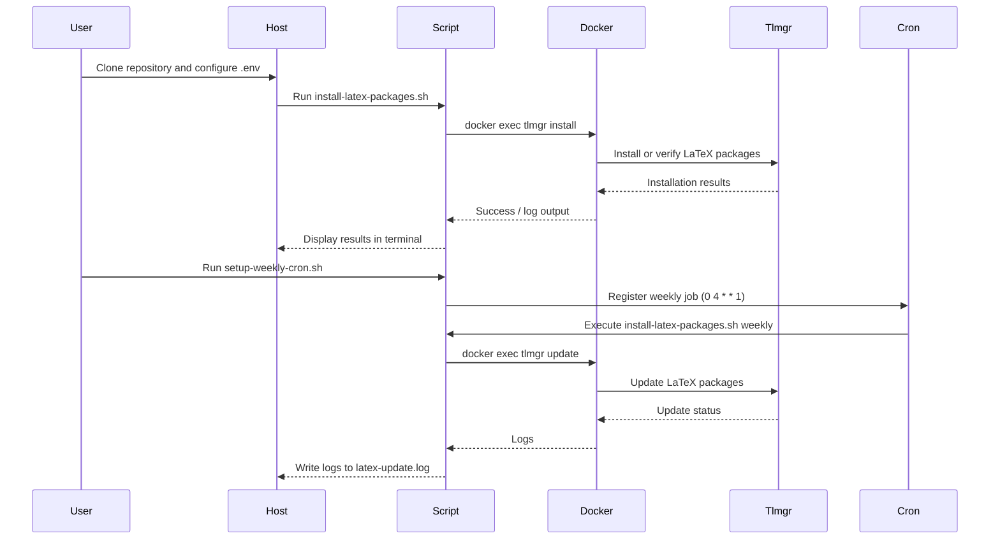

# Overleaf Toolkit Essential – Architecture and Design Overview

This document provides a technical overview of the internal architecture, data flow, and automation design of **Overleaf Toolkit Essential**.

---

## 1. System Overview

The toolkit automates **LaTeX environment management** for local Overleaf deployments using Docker.  
It ensures that required LaTeX packages are installed and updated automatically, maintaining parity with Overleaf's cloud environment.

!!! note
    The toolkit interacts only with TeX Live inside the container.  
    It does not modify Overleaf data or project files.

---

## 2. Architecture Diagram



!!! tip
    This Mermaid diagram is fully compatible with Mermaid v11.12.0.
    Avoid using `<br>` or extra quotes in node labels when working with Mermaid 11+.

---

## 3. Execution Flow Diagram

The following sequence diagram describes how the toolkit executes during setup, scheduled maintenance, and manual updates.



!!! note
    The flow is idempotent: running the same scripts multiple times produces the same system state.
    Existing packages are never reinstalled unnecessarily.

---

## 4. Component Responsibilities

| Component                     | Description                                                                               |
| ----------------------------- | ----------------------------------------------------------------------------------------- |
| **.env**                      | Defines all configuration values such as container name, project directory, and log path. |
| **load-env.sh**               | Reads and exports `.env` variables into the shell environment for reuse.                  |
| **install-latex-packages.sh** | Installs or verifies the presence of all essential LaTeX packages inside the container.   |
| **update-all-packages.sh**    | Performs a full TeX Live update (`tlmgr update --self --all`).                            |
| **setup-weekly-cron.sh**      | Registers a cron job that runs `install-latex-packages.sh` weekly.                        |
| **tlmgr (inside container)**  | TeX Live package manager responsible for installation and updates.                        |
| **cron**                      | Host-level scheduler that triggers updates automatically.                                 |

---

## 5. Key Design Principles

1. **Environment-Driven**
   Configuration and paths are controlled through a `.env` file.
   No hardcoded values inside scripts.

2. **Idempotent**
   Repeated runs cause no duplicate installations or conflicts.

3. **Non-Destructive**
   Only interacts with LaTeX package directories inside the container.

4. **Portable**
   Works across Linux, macOS, and WSL without modification.

5. **Modular and Extensible**
   New scripts can be added without changing core logic.

---

## 6. Automation Lifecycle

| Phase              | Action                                                  | Frequency            |
| ------------------ | ------------------------------------------------------- | -------------------- |
| **Initialization** | User clones repo, configures `.env`, and runs installer | Once                 |
| **Maintenance**    | Cron runs weekly to ensure consistency                  | Every Monday at 4 AM |
| **Manual Updates** | Developer runs `update-all-packages.sh`                 | On demand            |
| **Logging**        | Each cron job writes to `latex-update.log`              | Every execution      |

---

## 7. Security and Isolation

* All operations occur inside the Docker container using `docker exec`.
* The scripts never run privileged host commands.
* No modifications are made to Overleaf data directories.

!!! warning
    Always confirm your container name (`CONTAINER_NAME` in `.env`) before running scripts.
    Incorrect names may cause Docker commands to fail silently.

---

## 8. Example Integration (CI/CD)

Below is a simplified example for integrating automated updates into a GitHub Actions workflow:

```yaml
name: Overleaf Toolkit Maintenance

on:
  schedule:
    - cron: "0 3 * * 1"  # Every Monday at 3 AM

jobs:
  update-overleaf:
    runs-on: ubuntu-latest
    steps:
      - name: Checkout Repository
        uses: actions/checkout@v4

      - name: Load Environment
        run: source scripts/load-env.sh

      - name: Update LaTeX Packages
        run: ./scripts/update-all-packages.sh
```

---

## 9. Future Enhancements

* Cross-platform automation for Windows Task Scheduler
* Notification support (email, Slack, or webhook)
* Configurable package groups (via YAML or JSON)
* Integration with Docker Compose health checks

---

## 10. Summary

**Overleaf Toolkit Essential** centralizes configuration and automates LaTeX package maintenance for local Overleaf environments.
Its modular, environment-driven design ensures stability, portability, and minimal manual intervention.

The combination of `.env` configuration, reusable scripts, and automated scheduling makes it a reliable solution for maintaining a consistent LaTeX toolchain in Docker-based Overleaf setups.